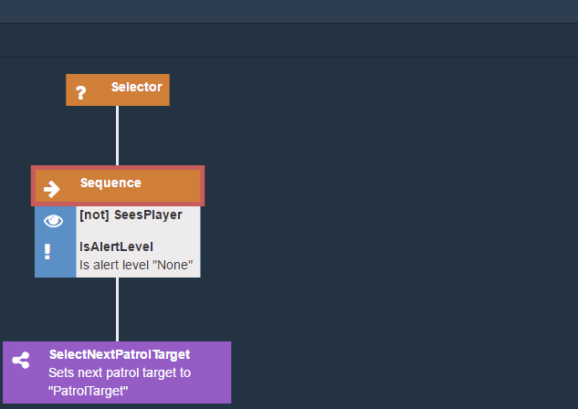

# owl-bt

owl-bt is editor for [Behavior trees](https://en.wikipedia.org/wiki/Behavior_tree_(artificial_intelligence,_robotics_and_control)). It has been inspired by [Unreal engine behavior trees](https://docs.unrealengine.com/latest/INT/Engine/AI/BehaviorTrees/NodeReference/index.html) in a way, that it supports special node items like decorators and services. This makes trees smaller and much more readable.

## Why
owl-bt has been created because we needed a behavior tree editor for our game [Tendril: Echo Received](https://forums.tigsource.com/index.php?topic=60709.0), where we are focusing on live npc behavior. 

We have tried some of the existing solutions, but they haven't meet our requirements like:
- focus on content and not on layout
- open format - we did not want to be bound to a specific game engine. For instance, we have created some of our game prototypes in Unity and the game itself is developed in MonoGame. In this way, we were able to take behavior trees from prototypes and use them directly in the game itself.
- ability to fully define item types
- to have fun developing it ;)

## Install
```sh
npm install owl-bt -g
```
## Usage
- help
```sh
owlbt -h
```
- Create a new project
```sh
cd <project-dir>
owlbt i
```
- Create a new tree (tree must be under an existing project)
```sh
owlbt c <tree-path>
```

- Open an existing tree
```sh
owlbt o path
```

## Configuration
owl-bt runs as a service on port `8955` by default. This can be changed in config file `.owlbtrc`, that must be created in the user`s home directory.

```json
{
	"port" : 1234
}
```

## Tree items


In owl-bt, there are three types of items:

- *Node* - represents a single task that can be executed at once or in multiple ticks. Composite nodes may contain child nodes.
- *Decorator* - node sub item, that guards access to its node and transforms node's return value. 
  - It is possible to mark decorator as periodic - represents, that the decorator should be reevaluated each tick, if its node is on the execution path.
- *Service* - node sub item, that executes a specific task at given times, if its node is on the execution path.

## Features
- Automatic layout - In order to focus only on content creation, there is no option for manually layout the tree. Tree is laid out automatically.
- Keyboard control - Almost entire tree can be created and edited using just keyboard. *owl-bt* contains command palette as in *Sumblime Text*. It can be accessed through `ctrl+shift+p`



- Hot project reload - each change to project file is instantly updated in running editor instance. Therefore it is easy to define or update node items without reloading tree, that is currently being edited. 


- Undo/redo - owl-bt supports undo/redo for all actions
- Json format - trees and project are stored as simple json files, which makes it easy to integrate with more or less any game engine

## Project file

Project file (`owl-bt.json`) defines all nodes and node item types that can be used in trees.

### Node
- *name* - (required) node type name 
- *base* - item to inherit from
- *isAbstract* - whether to allow creating items of this type - mainly for inheritance purposes
- *icon* - node icon (name of the icon from [font-awesome](http://fontawesome.io/icons/) without `fa-` prefix)
- *color* - custom color (css syntax - e.g. '#bada55' or 'green')
- *description* - node description. It may contain placeholders for properties `{{PropertyName}}`
- *isComposite* - whether node may contain another child nodes
- *properties* - list of node properties (see [property](#Property) definition)

### Decorator
- *name* - (required) decorator type name 
- *base* - item to inherit from
- *isAbstract* - whether to allow creating items of this type - mainly for inheritance purposes
- *icon* - decorator icon (name of the icon from [font-awesome](http://fontawesome.io/icons/) without `fa-` prefix)
- *color* - custom color (css syntax - e.g. '#bada55' or 'green')
- *description* - decorator description. It may contain placeholders for properties `{{PropertyName}}`
- *properties* - list of decorator properties (see [property](#Property) definition)

### Service
- *name* - (required) service type name 
- *base* - item to inherit from
- *isAbstract* - whether to allow creating items of this type - mainly for inheritance purposes
- *icon* - service icon (name of the icon from [font-awesome](http://fontawesome.io/icons/) without `fa-` prefix)
- *color* - custom color (css syntax - e.g. '#bada55' or 'green')
- *description* - service description. It may contain placeholders for properties `{{PropertyName}}`
- *properties* - list of service properties (see [property](#Property) definition)

### Property
- *name* - (required)
- *default* - default value
- *type* - type of the property
  - *string*
  - *number*
  - *bool*
  - *enum*
  - *custom type defined in project file*
- *values*- (required for enum type) - list of possible enum values
- *min*- (for number type) - min allowed value
- *max*- (for number type) - max allowed value

### Types
Enables to define custom property types
- *type* -  (required) base type for this custom type ['string' or 'number']
- *pattern* - regular expression for validation purposes

Example:
```json
{
  "types":{
    "myString" : {
      "type" : "string",
      "pattern" : "v[0-9]"
    }
  },
  "nodes": [
    {
      "name": "SetAlertLevel",
      "icon": "exclamation",
      "description": "Set alert level to \"{{Level}}\"",
      "isComposite": false,
      "properties": [
        {
          "name": "Level",
          "default": "None",
          "type": "enum",
          "values": [
            "None",
            "Investigate",
            "HighAlert",
            "Panic"
          ]
        }
      ]
    }
  ],
  "decorators": [
    {
      "name": "HasZoneReportedEnemy",
      "icon": "phone",
      "properties": [
        {
          "name": "MaxReportAge",
          "default": 1,
          "type": "number"
        }
      ]
    }
  ],
  "services": [
    {
      "name": "ReadPlayerPos",
      "icon": "pencil",
      "description": "Store player pos to \"{{BlackboardKey}}\"",
      "properties": [
        {
          "name": "BlackboardKey",
          "default": "Target",
          "type": "string"
        }
      ]
    }
  ]
}
```

## Tree file
```json
{
	"type": "Selector",
	"name": "rootNode",
	"childNodes": [
		{
			"type": "Sequence",
			"services": [
				{
					"type": "Sample service"
				}
			],
			"decorators": [
				{
					"type": "IsBlackboardValueSet",
					"properties": [
						{
							"name": "Field",
							"value": "myValue"
						}
					],
					"periodic": true
				}
			]
		}
	]
}
```

### Inheritance
It is possible to derive a node item type from another type using `base` setting.

It is possible to use `string` or `array of strings` for `base` setting. In case of array, base item types are applied in a specified order. That means, that the later item type overrides item specified before it.

E.q. we may create a base node:

```json
{
      "name": "MyBaseNode",
      "icon": "arrow-right",
      "color": "red",
      "isAbstract" : true,
      "properties": [
        {
          "name": "prop-from-base1",
          "type": "string"
        },
        {
          "name": "prop-from-base2",
          "type": "number"
        }
      ]
    },
```

And derived node:

```json
{
      "name": "MyDerivedNode",
      "color": "blue",
      "base": "MyBaseNode",
      "properties": [
        {
          "name": "prop1",
          "type": "string"
        },
        {
          "name": "prop-from-base2",
          "default" : "abc",          
          "type": "string"
        }
      ]
    },
```

Resulting node after applying inheritance is going to look like:

```json
{
      "name": "MyDerivedNode",
      "icon": "arrow-right",      
      "color": "blue",
      "base": "MyBaseNode",
      "properties": [
        {
          "name": "prop-from-base1",
          "type": "string"
        },
        {
          "name": "prop-from-base2",
          "default" : "abc",          
          "type": "string"
        },
        {
          "name": "prop1",
          "type": "string"
        }
      ]
    },
```

## Plugins
`owl-bt.js` file in the same directory as project file `owl-bt.json` is considered plugin.
Plugin js file exports object with plugin functions.

```js
module.exports = {
	onTreeSave: ({ tree, path, project, projectPath }) => {
	},
	onTreeLoad: ({ tree, path, project, projectPath }) => {
	}
}
```

- `onTreeSave` - executed before the tree json file is saved to disk. Only modifications of `tree` object are allowed.
  - `tree` - tree object (according to tree json file)
  - `path` - tree file path
  - `project` - project object (according to `owl-bt.json` file)
  - `projectPath` - project file path
  - `return` - when the return value is `false` or a string, then the save is prevented and error is returned to client
- `onTreeLoad` - executed after loading tree json file from disk. Only modifications of `tree` object are allowed.
  - `tree` - tree object (according to tree json file)
  - `path` - tree file path
  - `project` - project object (according to `owl-bt.json` file)
  - `projectPath` - project file path

It is possible for example to
 create a custom tree file formats using `onTreeSave` and `onTreeLoad`.
If we wanted to have project path stored in the tree file, we could create the following plugin:

```js
module.exports = {
	onTreeSave: ({ tree, path, project, projectPath }) => {
		tree.projectPath = projectPath;
	}
}
```

## Changelog
### 1.1.0
- Add support for tree item type inheritance - see `base` and `isAbstract` properties in project definition
- Add support to override tree item type color
- Add support to remove items from MRU list
- Add support to modify tree before save and after load through plugins
- Prevent save of tree when current node item has validation errors in property editor
- Add support for custom property types
- Add item color to new item selection dialog
- Add item palette side panel
- Make side panels collapsible

### 1.2.0
- Add support for multiple base types. Thanks to [dauryg](https://github.com/dauryg)
- Add save success notification message

### 1.3.0
- Add support to prevent save of a tree in plugin
- Add reloading of plugins
- Prevent losing values of invalid properties in property editor form
- Add highlighting of all tree items with invalid properties
- Add save confirmation before saving a tree with invalid properties

### 2.0.0
- Add option to change type of an existing node. (`ctrl+shift+p`->`'core:Set Node Type'` or `rmb`->`'Set Node Type'`) 
- (breaking change): Fontawesome upgraded to 5.*
- (chore): Convert from Grunt+Bower+Karma to Webpack+Jest

### 2.1.0
- Add custom label to node items
- Add comment to node items
